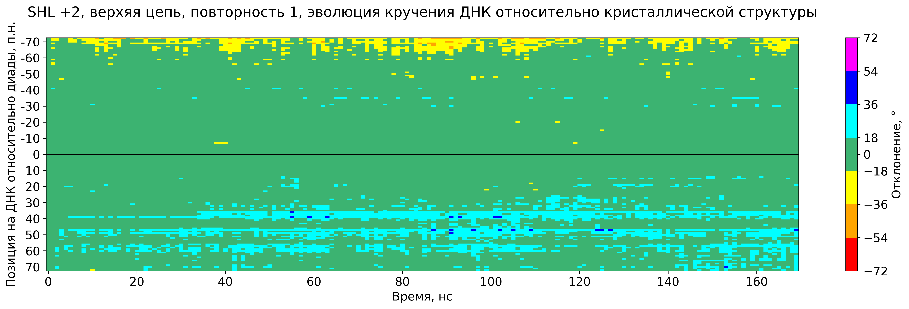
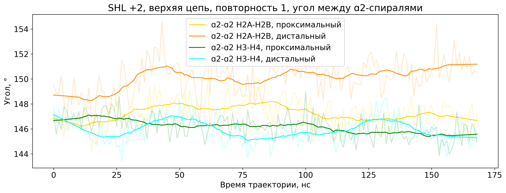

### SHL +2, верхняя цепь, повторность 1 - траектория молекулярной динамики нуклеосомы с управляемым формированием торсионного дефекта (PDB ID 3LZ0)
[Назад](http://intbio.github.io/grant_2023_RNFmoluch/year3/)

<html lang="en">
  <head>
    <meta charset="utf-8">
    
  </head>

  <body>

     
    
H3

    
H4

    
H2A

    
H2B
  
    
ДНК
  
	
ДНК, смещаемый фрагмент
  
	
ДНК, фрагмент для выравнивания

     
    
Синий и оранжевый шары обозначают проксимальный и дистальный концы ДНК

    <input class="form-check-input " type="checkbox" name="ref_str_check" value="" id="ref_str_check">
    <label class="form-check-label " for="ref_str_check">
      Show starting state
    </label>
    
    <input class="form-check-input " type="checkbox" name="ortho_check" value="" id="ortho_check" checked="true">
    <label class="form-check-label " for="ortho_check">
      Orthographic
    </label>
    
    <input class="form-check-input " type="checkbox" name="axes_check" value="" id="axes_check">
    <label class="form-check-label " for="ortho_check">
      Show axes
    </label>
    
    
    
    <input class="form-check-input " type="checkbox" name="arg_lys_check" value="" id="arg_lys_check">
    <label class="form-check-label " for="arg_lys_check">
      Show ARG LYS
    </label> 
    <!--
    <input class="form-check-input " type="checkbox" name="latch_check" value="" id="latch_check">
    <label class="form-check-label " for="latch_check">
      Show H3 39-49 DNA latch
    </label> -->

    <input class="form-check-input " type="checkbox" name="highlight_DA_check" value="" id="highlight_DA_check">
    <label class="form-check-label " for="highlight_DA_check">
      Highlight ADE
    </label>

    

    

      <button type="submit" class="btn" name="play_button" data-toggle="button" id='play' onclick='window.traj.player.play();'>Play</button>
      <button type="submit" class="btn" name="play_button" data-toggle="button" id='pause' onclick='window.traj.player.pause();'>Pause</button>
      <input type="range" min="0" max="100" value="0" class="slider" id="myRange">
      
Time:  ns

    

    <figure>
      
    </figure>
        <figure>
      
    </figure>
  </body>
</html>
